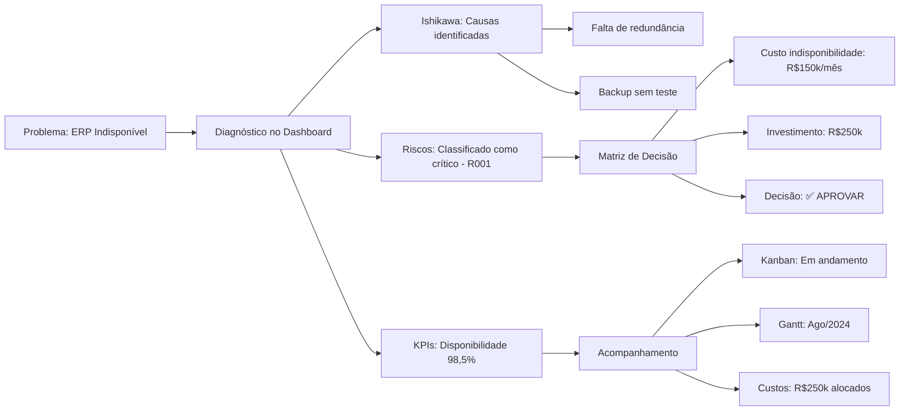

<div align="center">

</div>

# Run and deploy your AI Studio app

This contains everything you need to run your app locally.

View your app in AI Studio: https://ai.studio/apps/d93f9d92-c682-4075-bc4c-0b91d5ce25b5

## Run Locally

**Prerequisites:**  Node.js


1. Install dependencies:
   `npm install`
2. Set the `GEMINI_API_KEY` in [.env.local](.env.local) to your Gemini API key
3. Run the app:
   `npm run dev`
_____________________________________________________________________________________________

Aqui está o README completo com todas as marcações Markdown adequadas para o GitHub:

```markdown
# 📊 Dashboard de Governança, Riscos e Compliance em TI

<p align="center">
  
  
  
  
  
  
</p>

<p align="center">
  
  
  
</p>

---

## 📋 Sobre o Projeto

Dashboard interativo desenvolvido no **Google Looker Studio** para gestão integrada de **Riscos, Compliance e Tomada de Decisão em TI**, aplicado a um cenário real de transformação digital em uma empresa de médio porte do setor de serviços.

O projeto foi desenvolvido como trabalho acadêmico para a disciplina de **Risk Management and IT Compliance**, integrando frameworks e normas como ISO 31000, ISO/IEC 27001, COBIT e LGPD.

### 🎯 Objetivos

- ✅ Identificar e analisar riscos de TI sob perspectivas técnica, organizacional e legal
- ✅ Garantir conformidade com normas e regulamentações
- ✅ Apoiar a tomada de decisão segura e responsável
- ✅ Propor diretrizes práticas para governança de TI
- ✅ Consolidar informações em um único painel executivo e operacional

---

## 🏗️ Estrutura do Dashboard

O dashboard é composto por **23 abas** organizadas em 5 camadas:

```mermaid
graph TD
    A[DASHBOARD EXECUTIVO] --> B[CAMADA 1: VISÃO ESTRATÉGICA]
    A --> C[CAMADA 2: GOVERNANÇA]
    A --> D[CAMADA 3: OPERACIONAL]
    A --> E[CAMADA 4: DECISÃO E CONTROLE]
    A --> F[CAMADA 5: CULTURA E STAKEHOLDERS]
    
    B --> B1[Visão Geral]
    B --> B2[KPIs e Resultados]
    B --> B3[Gestão de Riscos ISO 31000]
    
    C --> C1[Conformidade e ISO]
    C --> C2[Controles ISO 27001]
    C --> C3[Governança COBIT]
    C --> C4[LGPD e Privacidade]
    
    D --> D1[Análise 5W2H]
    D --> D2[Ishikawa]
    D --> D3[SWOT]
    D --> D4[PDCA]
    D --> D5[Kanban]
    D --> D6[Roadmap/Gantt]
    
    E --> E1[Matriz de Decisão]
    E --> E2[Plano de Continuidade]
    E --> E3[Qualidade e NC's]
    E --> E4[Tecnologias]
    E --> E5[Organograma]
    E --> E6[Custos e Investimentos]
    
    F --> F1[Ética e ESG]
    F --> F2[Cultura e Capacitação]
    F --> F3[Stakeholders e Comunicação]
    F --> F4[Auditoria e Monitoramento]
    F --> F5[Chat IA Governança]
```



---

## 🛠️ Tecnologias Utilizadas

| Tecnologia | Aplicação | Ícone |
|------------|-----------|-------|
| **Google Looker Studio** | Plataforma principal do dashboard |  |
| **Google Sheets** | Base de dados e integração |  |
| **ISO 31000** | Gestão de riscos |  |
| **ISO 27001** | Segurança da informação |  |
| **COBIT** | Governança de TI |  |
| **LGPD** | Proteção de dados |  |

---

## 📊 Funcionalidades por Aba

### 📌 Abas Existentes Adaptadas

<details>
<summary>Clique para expandir</summary>

| Aba | Descrição | Ícone |
|-----|-----------|-------|
| **Visão Geral** | Contexto da organização, objetivos estratégicos e problemas identificados | 📋 |
| **Análise 5W2H** | Planos de ação detalhados para riscos prioritários | ❓ |
| **Ishikawa** | Análise de causas raiz dos problemas de TI | 🐟 |
| **SWOT** | Diagnóstico estratégico de forças, fraquezas, oportunidades e ameaças | 📊 |
| **PDCA** | Ciclo de melhoria contínua para gestão de riscos | 🔄 |
| **Kanban** | Acompanhamento visual das ações de compliance | 📌 |
| **Roadmap/Gantt** | Cronograma de implementação com marcos e responsáveis | 📅 |
| **KPIs e Resultados** | Indicadores de desempenho e tendências | 📈 |
| **Qualidade e NC's** | Registro e acompanhamento de não conformidades | ⚠️ |
| **Ética e ESG** | Iniciativas ambientais, sociais e de governança | 🌱 |
| **Tecnologias** | Inventário de sistemas críticos e vulnerabilidades | 💻 |
| **Organograma** | Estrutura organizacional e matriz RACI | 👥 |
| **Chat IA Governança** | Simulação de diálogos para apoio à decisão | 🤖 |

</details>

### ✨ Novas Abas Criadas

<details open>
<summary>Clique para expandir</summary>

| Aba | Descrição | Base Normativa | Ícone |
|-----|-----------|----------------|-------|
| **Análise de Riscos de TI** | Matriz de riscos, probabilidade x impacto, plano de tratamento | ISO 31000 | 🎯 |
| **Controles ISO 27001** | Mapeamento de controles do Anexo A, status e evidências | ISO/IEC 27001 | 🔒 |
| **Governança COBIT** | Alinhamento com processos COBIT e níveis de capacidade | COBIT 2019 | 🏛️ |
| **LGPD e Privacidade** | Mapeamento de dados, direitos dos titulares, incidentes | LGPD | 🔐 |
| **Plano de Continuidade** | BIA, RTO/RPO, estratégias e testes | ISO 22301 | 🔄 |
| **Matriz de Decisão** | Árvore de decisão, níveis de autorização, scorecard | COBIT | ⚖️ |
| **Cultura e Capacitação** | Programa de treinamentos, calendário e avaliações | ISO 27001 A.7 | 📚 |
| **Auditoria e Monitoramento** | Plano de auditoria, monitoramento contínuo, painel de incidentes | ISO 19011 | 👁️ |
| **Custos e Investimentos** | Orçamento, ROI de projetos, custo da não conformidade | COBIT | 💰 |
| **Stakeholders e Comunicação** | Mapa de stakeholders, plano de comunicação, feedback | ISO 31000 | 📢 |

</details>

---

## 📈 Principais Indicadores (KPIs)

| KPI | Fórmula | Meta | Status Atual |
|-----|---------|------|--------------|
| **Disponibilidade de sistemas** | (Tempo total - Indisponível) / Tempo total | ≥ 99,5% | 🟡 98,5% |
| **MTBF (Tempo entre falhas)** | Soma tempos operacionais / Nº falhas | ≥ 30 dias | 🔴 7 dias |
| **MTTR (Tempo de reparo)** | Soma tempos reparo / Nº falhas | ≤ 1 hora | 🟡 2 horas |
| **Incidentes de segurança** | Número absoluto mensal | ≤ 5 | 🔴 12 |
| **Acessos revisados** | Acessos revisados / Total de acessos | 100% | 🔴 30% |
| **Treinamentos realizados** | Funcionários treinados / Total | 100% | 🔴 35% |
| **Não conformidades** | Número absoluto | ≤ 3 | 🔴 8 |

**Legenda:**
- 🟢 Bom (dentro da meta)
- 🟡 Atenção (próximo do limite)
- 🔴 Crítico (fora da meta)

---

## 🔍 Exemplo de Aplicação

### Problema: Indisponibilidade do ERP



---

## 🚀 Como Utilizar

### Pré-requisitos

- ✅ Conta Google (para acesso ao Looker Studio)
- ✅ Permissão de edição no dashboard (solicitar ao administrador)

### Acesso ao Dashboard

1. Acesse [Google Looker Studio](https://lookerstudio.google.com/)
2. Faça login com sua conta Google
3. Solicite acesso ao projeto através do link:

```bash
🔗 https://lookerstudio.google.com/reporting/seu-link-aqui
```

### Atualização de Dados

Os dados são alimentados através de planilhas Google Sheets integradas:

| Planilha | Fonte | Atualização | Ícone |
|----------|-------|-------------|-------|
| Riscos | Google Sheets | Semanal | 📝 |
| Incidentes | Service Desk | Diária | 🚨 |
| KPIs | Banco de dados | Automática | 📊 |
| Treinamentos | RH | Mensal | 🎓 |

---

## 📚 Fundamentação Teórica

### Normas e Frameworks Aplicados

| Norma | Aplicação | Documentação |
|-------|-----------|--------------|
| **ISO 31000** | Gestão de riscos (identificação, análise, avaliação, tratamento) | [🔗 Link](https://www.iso.org/iso-31000-risk-management.html) |
| **ISO/IEC 27001** | Controles de segurança da informação (Anexo A) | [🔗 Link](https://www.iso.org/isoiec-27001-information-security.html) |
| **COBIT 2019** | Governança de TI e alinhamento estratégico | [🔗 Link](https://www.isaca.org/resources/cobit) |
| **LGPD** | Proteção de dados pessoais e privacidade | [🔗 Link](https://www.gov.br/cidadania/pt-br/acesso-a-informacao/lgpd) |
| **ISO 22301** | Continuidade de negócios | [🔗 Link](https://www.iso.org/iso-22301-business-continuity.html) |

### Metodologias

| Metodologia | Aplicação | Ícone |
|-------------|-----------|-------|
| **5W2H** | Detalhamento de planos de ação | ❓ |
| **Ishikawa** | Análise de causas raiz | 🐟 |
| **SWOT** | Análise estratégica | 📊 |
| **PDCA** | Melhoria contínua | 🔄 |
| **Kanban** | Gestão visual de tarefas | 📌 |
| **RACI** | Definição de papéis e responsabilidades | 👥 |

---

## 🗺️ Roadmap de Implementação

| Fase | Atividades | Período | Status | Progresso |
|------|------------|---------|--------|-----------|
| **Fase 1** | Diagnóstico, inventário, mapeamento de riscos | Mês 1-2 | ✅ Concluído | ██████████ 100% |
| **Fase 2** | Políticas, IAM, plano de continuidade | Mês 3-5 | 🔄 Em andamento | ████░░░░░░ 40% |
| **Fase 3** | Monitoramento, auditoria, certificação | Mês 6-8 | ⏳ Pendente | ░░░░░░░░░░ 0% |
| **Fase 4** | Melhoria contínua, expansão | Mês 9-12 | ⏳ Pendente | ░░░░░░░░░░ 0% |

---

## 👥 Equipe e Responsabilidades

| Papel | Responsável | Principais Atividades | Contato |
|-------|-------------|----------------------|---------|
| **Diretor de TI** | Carlos Mendes | Decisões estratégicas, aprovações | 📧 c.mendes@empresa.com |
| **Gerente de Infraestrutura** | Pedro Lima | Continuidade, backups, infraestrutura | 📧 p.lima@empresa.com |
| **Gerente de Sistemas** | Ana Souza | Aplicações, desenvolvimento | 📧 a.souza@empresa.com |
| **Gerente de Segurança** | Carla Reis | Controles ISO 27001, gestão de riscos | 📧 c.reis@empresa.com |
| **DPO (Encarregado)** | Mariana Santos | LGPD, privacidade | 📧 m.santos@empresa.com |
| **Analista de Compliance** | João Oliveira | Auditoria, conformidade | 📧 j.oliveira@empresa.com |

### Matriz RACI Simplificada

| Atividade | Diretor | Infra | Sistemas | Segurança | DPO |
|-----------|:-------:|:-----:|:--------:|:---------:|:---:|
| Gestão de Riscos | A | C | C | **R** | C |
| Controle de Acessos | A | C | C | **R** | I |
| Continuidade | A | **R** | C | C | I |
| LGPD | C | I | C | C | **R** |
| Decisões > R$200k | **A** | C | C | C | I |

*Legenda: R = Responsável, A = Accountable, C = Consultado, I = Informado*

---

## 📝 Licença

Este projeto está licenciado sob a licença MIT - veja o arquivo [LICENSE](LICENSE) para detalhes.

```
MIT License

Copyright (c) 2024 [Seu Nome]

Permission is hereby granted, free of charge, to any person obtaining a copy
of this software and associated documentation files...
```

---

## 🤝 Contribuições

Contribuições são bem-vindas! Para contribuir:

1. 🍴 Faça um fork do projeto
2. 🌿 Crie uma branch para sua feature (`git checkout -b feature/NovaFeature`)
3. 💾 Commit suas mudanças (`git commit -m 'Adiciona NovaFeature'`)
4. 📤 Push para a branch (`git push origin feature/NovaFeature`)
5. 🔃 Abra um Pull Request

```bash
# Comandos úteis
git clone https://github.com/seu-usuario/dashboard-riscos-compliance-ti.git
cd dashboard-riscos-compliance-ti
git checkout -b minha-feature
git add .
git commit -m "Minha contribuição"
git push origin minha-feature
```

---

## 📞 Contato

<div align="center">

| | | |
|:---:|:---:|:---:|
|  | **Autor** | [Seu Nome] |
|  | **E-mail** | [seu.email@exemplo.com](mailto:seu.email@exemplo.com) |
|  | **LinkedIn** | [Perfil no LinkedIn](https://linkedin.com/in/seu-perfil) |
|  | **Instituição** | [Nome da Faculdade/Universidade] |

</div>

---

## 🙏 Agradecimentos

- 👨‍🏫 Professores e orientadores da disciplina
- 👥 Equipe de TI da organização parceira
- 🌐 Comunidade de frameworks e normas técnicas
- 📚 Todos que contribuíram com feedback e sugestões

---

<div align="center">
  
  **Desenvolvido com ❤️ para gestão de riscos e compliance em TI**
  
  
  
  
  ***Última atualização: Março de 2024***
  
</div>
```

## 📦 Estrutura Completa do Repositório

Para criar todos os arquivos de uma vez no terminal:

```bash
# Criar diretório do projeto
mkdir dashboard-riscos-compliance-ti
cd dashboard-riscos-compliance-ti

# Criar README.md (cole o conteúdo acima)
cat > README.md

# Criar .gitignore
cat > .gitignore << 'EOF'
# Arquivos temporários
*.tmp
*.log
.DS_Store
Thumbs.db
*.swp
*.swo
*~

# Arquivos de configuração local
.env
.env.local
.env.*.local
config.local.json
config.local.yaml

# Backups
*.bak
*.backup
*.old

# Planilhas com dados sensíveis
*sensitive*.xlsx
*confidential*.csv
*private*.xlsx
*dados_pessoais*.csv

# Diretórios
node_modules/
vendor/
dist/
build/
*.pyc
__pycache__/
EOF

# Criar LICENSE (MIT)
cat > LICENSE << 'EOF'
MIT License

Copyright (c) 2024 [Seu Nome]

Permission is hereby granted, free of charge, to any person obtaining a copy
of this software and associated documentation files (the "Software"), to deal
in the Software without restriction, including without limitation the rights
to use, copy, modify, merge, publish, distribute, sublicense, and/or sell
copies of the Software, and to permit persons to whom the Software is
furnished to do so, subject to the following conditions:

The above copyright notice and this permission notice shall be included in all
copies or substantial portions of the Software.

THE SOFTWARE IS PROVIDED "AS IS", WITHOUT WARRANTY OF ANY KIND, EXPRESS OR
IMPLIED, INCLUDING BUT NOT LIMITED TO THE WARRANTIES OF MERCHANTABILITY,
FITNESS FOR A PARTICULAR PURPOSE AND NONINFRINGEMENT. IN NO EVENT SHALL THE
AUTHORS OR COPYRIGHT HOLDERS BE LIABLE FOR ANY CLAIM, DAMAGES OR OTHER
LIABILITY, WHETHER IN AN ACTION OF CONTRACT, TORT OR OTHERWISE, ARISING FROM,
OUT OF OR IN CONNECTION WITH THE SOFTWARE OR THE USE OR OTHER DEALINGS IN THE
SOFTWARE.
EOF

# Inicializar Git e fazer commit
git init
git add .
git commit -m "Initial commit: Adiciona README, LICENSE e .gitignore"

# Conectar ao GitHub (substitua com seu usuário)
git remote add origin https://github.com/seu-usuario/dashboard-riscos-compliance-ti.git
git branch -M main
git push -u origin main
```

## ✅ Checklist de Publicação

- [x] README.md com todas as seções completas
- [x] Badges de status e tecnologias
- [x] Diagramas Mermaid
- [x] Tabelas formatadas
- [x] Seções expansíveis (details/summary)
- [x] Códigos de exemplo
- [x] Emojis para melhor visualização
- [x] Links úteis
- [x] Licença MIT
- [x] .gitignore configurado

Agora é só copiar e colar no seu repositório GitHub! 🚀
