<div align="center">

</div>

# Run and deploy your AI Studio app

This contains everything you need to run your app locally.

View your app in AI Studio: https://ai.studio/apps/d93f9d92-c682-4075-bc4c-0b91d5ce25b5

## Run Locally

**Prerequisites:**  Node.js


1. Install dependencies:
   `npm install`
2. Set the `GEMINI_API_KEY` in [.env.local](.env.local) to your Gemini API key
3. Run the app:
   `npm run dev`
_____________________________________________________________________________________________

## 🏗️ Estrutura do Dashboard

O dashboard é composto por **23 abas** organizadas em 5 camadas estratégicas:

### 📊 Visão Geral da Arquitetura

```mermaid
graph TD
    A[🎯 DASHBOARD EXECUTIVO] --> B[📋 CAMADA 1: VISÃO ESTRATÉGICA]
    A --> C[🏛️ CAMADA 2: GOVERNANÇA]
    A --> D[⚙️ CAMADA 3: OPERACIONAL]
    A --> E[⚖️ CAMADA 4: DECISÃO E CONTROLE]
    A --> F[👥 CAMADA 5: CULTURA E STAKEHOLDERS]
    
    B --> B1[📌 Visão Geral]
    B --> B2[📈 KPIs e Resultados]
    B --> B3[🎯 Gestão de Riscos ISO 31000]
    
    C --> C1[✅ Conformidade e ISO]
    C --> C2[🔒 Controles ISO 27001]
    C --> C3[🏛️ Governança COBIT]
    C --> C4[🔐 LGPD e Privacidade]
    
    D --> D1[❓ Análise 5W2H]
    D --> D2[🐟 Ishikawa]
    D --> D3[📊 SWOT]
    D --> D4[🔄 PDCA]
    D --> D5[📌 Kanban]
    D --> D6[📅 Roadmap/Gantt]
    
    E --> E1[⚖️ Matriz de Decisão]
    E --> E2[🔄 Plano de Continuidade]
    E --> E3[⚠️ Qualidade e NC's]
    E --> E4[💻 Tecnologias]
    E --> E5[👥 Organograma]
    E --> E6[💰 Custos e Investimentos]
    
    F --> F1[🌱 Ética e ESG]
    F --> F2[📚 Cultura e Capacitação]
    F --> F3[📢 Stakeholders e Comunicação]
    F --> F4[👁️ Auditoria e Monitoramento]
    F --> F5[🤖 Chat IA Governança]
```



---

### 📋 Detalhamento das Camadas

<details open>
<summary><b>📌 CAMADA 1: VISÃO ESTRATÉGICA</b></summary>
<br>

| Aba | Descrição | Principais Funcionalidades | Ícone |
|-----|-----------|---------------------------|:-----:|
| **Visão Geral** | Contexto da organização, objetivos estratégicos e problemas identificados | • Dados da empresa<br>• Objetivos estratégicos<br>• Problemas identificados | 📋 |
| **KPIs e Resultados** | Indicadores de desempenho e tendências | • Métricas em tempo real<br>• Tendências mensais<br>• Comparativo com metas | 📈 |
| **Gestão de Riscos ISO 31000** | Matriz de riscos, probabilidade x impacto, plano de tratamento | • Identificação de riscos<br>• Matriz de calor<br>• Plano de tratamento | 🎯 |

</details>

<details open>
<summary><b>🏛️ CAMADA 2: GOVERNANÇA</b></summary>
<br>

| Aba | Descrição | Principais Funcionalidades | Ícone |
|-----|-----------|---------------------------|:-----:|
| **Conformidade e ISO** | Mapeamento de requisitos normativos e status de conformidade | • Normas aplicáveis<br>• Status de implementação<br>• Evidências de conformidade | ✅ |
| **Controles ISO 27001** | Mapeamento de controles do Anexo A, status e evidências | • 93 controles mapeados<br>• Status por domínio<br>• Gráfico de maturidade | 🔒 |
| **Governança COBIT** | Alinhamento com processos COBIT e níveis de capacidade | • Processos EDM, APO, DSS, MEA<br>• Níveis de capacidade<br>• Indicadores de governança | 🏛️ |
| **LGPD e Privacidade** | Mapeamento de dados, direitos dos titulares, incidentes | • Mapeamento de dados pessoais<br>• Direitos dos titulares<br>• Incidentes de privacidade | 🔐 |

</details>

<details open>
<summary><b>⚙️ CAMADA 3: OPERACIONAL</b></summary>
<br>

| Aba | Descrição | Principais Funcionalidades | Ícone |
|-----|-----------|---------------------------|:-----:|
| **Análise 5W2H** | Planos de ação detalhados para riscos prioritários | • What? Why? Where? When? Who? How? How much?<br>• Responsáveis e prazos<br>• Custos envolvidos | ❓ |
| **Ishikawa** | Análise de causas raiz dos problemas de TI | • Diagrama de espinha de peixe<br>• 6Ms (Método, Mão de obra, Material, Máquina, Medição, Ambiente)<br>• Causas identificadas | 🐟 |
| **SWOT** | Diagnóstico estratégico de forças, fraquezas, oportunidades e ameaças | • Forças (Strengths)<br>• Fraquezas (Weaknesses)<br>• Oportunidades (Opportunities)<br>• Ameaças (Threats) | 📊 |
| **PDCA** | Ciclo de melhoria contínua para gestão de riscos | • Planejar (Plan)<br>• Executar (Do)<br>• Verificar (Check)<br>• Agir (Act) | 🔄 |
| **Kanban** | Acompanhamento visual das ações de compliance | • A Fazer<br>• Em Andamento<br>• Revisão<br>• Concluído | 📌 |
| **Roadmap/Gantt** | Cronograma de implementação com marcos e responsáveis | • Fases do projeto<br>• Marcos importantes<br>• Responsáveis e prazos | 📅 |

</details>

<details open>
<summary><b>⚖️ CAMADA 4: DECISÃO E CONTROLE</b></summary>
<br>

| Aba | Descrição | Principais Funcionalidades | Ícone |
|-----|-----------|---------------------------|:-----:|
| **Matriz de Decisão** | Árvore de decisão, níveis de autorização, scorecard | • Árvore de decisão<br>• Níveis de autorização por valor<br>• Scorecard de decisões | ⚖️ |
| **Plano de Continuidade** | BIA, RTO/RPO, estratégias e testes | • Análise de Impacto nos Negócios<br>• RTO e RPO por sistema<br>• Estratégias e testes | 🔄 |
| **Qualidade e NC's** | Registro e acompanhamento de não conformidades | • Registro de NCs<br>• Causa raiz<br>• Ações corretivas e prazos | ⚠️ |
| **Tecnologias** | Inventário de sistemas críticos e vulnerabilidades | • Inventário de sistemas<br>• Nível de criticidade<br>• Vulnerabilidades identificadas | 💻 |
| **Organograma** | Estrutura organizacional e matriz RACI | • Estrutura hierárquica<br>• Matriz RACI detalhada<br>• Responsabilidades por processo | 👥 |
| **Custos e Investimentos** | Orçamento, ROI de projetos, custo da não conformidade | • Orçamento por categoria<br>• ROI de projetos<br>• Custo da não conformidade | 💰 |

</details>

<details open>
<summary><b>👥 CAMADA 5: CULTURA E STAKEHOLDERS</b></summary>
<br>

| Aba | Descrição | Principais Funcionalidades | Ícone |
|-----|-----------|---------------------------|:-----:|
| **Ética e ESG** | Iniciativas ambientais, sociais e de governança | • Environmental (Ambiental)<br>• Social (Social)<br>• Governance (Governança) | 🌱 |
| **Cultura e Capacitação** | Programa de treinamentos, calendário e avaliações | • Programa de treinamentos<br>• Calendário de capacitação<br>• Avaliação de cultura de segurança | 📚 |
| **Stakeholders e Comunicação** | Mapa de stakeholders, plano de comunicação, feedback | • Mapa de stakeholders<br>• Plano de comunicação<br>• Feedback e satisfação | 📢 |
| **Auditoria e Monitoramento** | Plano de auditoria, monitoramento contínuo, painel de incidentes | • Plano de auditoria<br>• Monitoramento contínuo<br>• Painel de incidentes | 👁️ |
| **Chat IA Governança** | Simulação de diálogos para apoio à decisão | • Simulação de diálogos<br>• Análise de situações<br>• Recomendações baseadas em normas | 🤖 |

</details>

---

### 📊 Resumo das Abas por Categoria

| Categoria | Quantidade de Abas | Principais Funcionalidades |
|-----------|:------------------:|---------------------------|
| **Visão Estratégica** | 3 | Monitoramento de alto nível, KPIs, riscos estratégicos |
| **Governança** | 4 | Conformidade normativa, controles, frameworks |
| **Operacional** | 6 | Análises, planejamento, execução e acompanhamento |
| **Decisão e Controle** | 6 | Suporte à decisão, continuidade, qualidade, custos |
| **Cultura e Stakeholders** | 4 | Pessoas, comunicação, auditoria, ética |
| **TOTAL** | **23** | **Dashboard integrado e completo** |

---

### 🎯 Benefícios da Estrutura em Camadas

| Camada | Benefício Principal | Público-Alvo |
|--------|---------------------|--------------|
| **Visão Estratégica** | Tomada de decisão de alto nível | Alta gestão, diretores |
| **Governança** | Garantia de conformidade e boas práticas | Comitê de TI, DPO, auditores |
| **Operacional** | Execução e acompanhamento de ações | Times de TI, infraestrutura, desenvolvimento |
| **Decisão e Controle** | Suporte à decisão baseada em dados | Gestores, coordenadores |
| **Cultura e Stakeholders** | Engajamento e comunicação | RH, comunicação, todos os funcionários |

---

Esta estrutura garante que **todas as perspectivas** necessárias para uma gestão eficaz de riscos e compliance em TI sejam contempladas, desde o nível estratégico até o operacional, passando pela governança e pelo engajamento das pessoas.
```


```

---

## 🚀 Como Utilizar

### Pré-requisitos

- ✅ Conta Google (para acesso ao Looker Studio)
- ✅ Permissão de edição no dashboard (solicitar ao administrador)

### Acesso ao Dashboard

1. Acesse [Google Looker Studio](https://lookerstudio.google.com/)
2. Faça login com sua conta Google
3. Solicite acesso ao projeto através do link:

```bash
🔗 https://lookerstudio.google.com/reporting/seu-link-aqui
```

### Atualização de Dados

Os dados são alimentados através de planilhas Google Sheets integradas:

| Planilha | Fonte | Atualização | Ícone |
|----------|-------|-------------|-------|
| Riscos | Google Sheets | Semanal | 📝 |
| Incidentes | Service Desk | Diária | 🚨 |
| KPIs | Banco de dados | Automática | 📊 |
| Treinamentos | RH | Mensal | 🎓 |

---

## 📚 Fundamentação Teórica

### Normas e Frameworks Aplicados

| Norma | Aplicação | Documentação |
|-------|-----------|--------------|
| **ISO 31000** | Gestão de riscos (identificação, análise, avaliação, tratamento) | [🔗 Link](https://www.iso.org/iso-31000-risk-management.html) |
| **ISO/IEC 27001** | Controles de segurança da informação (Anexo A) | [🔗 Link](https://www.iso.org/isoiec-27001-information-security.html) |
| **COBIT 2019** | Governança de TI e alinhamento estratégico | [🔗 Link](https://www.isaca.org/resources/cobit) |
| **LGPD** | Proteção de dados pessoais e privacidade | [🔗 Link](https://www.gov.br/cidadania/pt-br/acesso-a-informacao/lgpd) |
| **ISO 22301** | Continuidade de negócios | [🔗 Link](https://www.iso.org/iso-22301-business-continuity.html) |

### Metodologias

| Metodologia | Aplicação | Ícone |
|-------------|-----------|-------|
| **5W2H** | Detalhamento de planos de ação | ❓ |
| **Ishikawa** | Análise de causas raiz | 🐟 |
| **SWOT** | Análise estratégica | 📊 |
| **PDCA** | Melhoria contínua | 🔄 |
| **Kanban** | Gestão visual de tarefas | 📌 |
| **RACI** | Definição de papéis e responsabilidades | 👥 |

---

## 🗺️ Roadmap de Implementação

| Fase | Atividades | Período | Status | Progresso |
|------|------------|---------|--------|-----------|
| **Fase 1** | Diagnóstico, inventário, mapeamento de riscos | Mês 1-2 | ✅ Concluído | ██████████ 100% |
| **Fase 2** | Políticas, IAM, plano de continuidade | Mês 3-5 | 🔄 Em andamento | ████░░░░░░ 40% |
| **Fase 3** | Monitoramento, auditoria, certificação | Mês 6-8 | ⏳ Pendente | ░░░░░░░░░░ 0% |
| **Fase 4** | Melhoria contínua, expansão | Mês 9-12 | ⏳ Pendente | ░░░░░░░░░░ 0% |

---

### Matriz RACI Simplificada

| Atividade | Diretor | Infra | Sistemas | Segurança | DPO |
|-----------|:-------:|:-----:|:--------:|:---------:|:---:|
| Gestão de Riscos | A | C | C | **R** | C |
| Controle de Acessos | A | C | C | **R** | I |
| Continuidade | A | **R** | C | C | I |
| LGPD | C | I | C | C | **R** |
| Decisões > R$200k | **A** | C | C | C | I |

*Legenda: R = Responsável, A = Accountable, C = Consultado, I = Informado*

---

## 📝 Licença

Este projeto está licenciado sob a licença MIT - veja o arquivo [LICENSE](LICENSE) para detalhes.

```
MIT License

Copyright (c) 2024 [Seu Nome]

Permission is hereby granted, free of charge, to any person obtaining a copy
of this software and associated documentation files...
```

---

## 🤝 Contribuições

Contribuições são bem-vindas! Para contribuir:

1. 🍴 Faça um fork do projeto
2. 🌿 Crie uma branch para sua feature (`git checkout -b feature/NovaFeature`)
3. 💾 Commit suas mudanças (`git commit -m 'Adiciona NovaFeature'`)
4. 📤 Push para a branch (`git push origin feature/NovaFeature`)
5. 🔃 Abra um Pull Request

```bash
# Comandos úteis
git clone https://github.com/seu-usuario/dashboard-riscos-compliance-ti.git
cd dashboard-riscos-compliance-ti
git checkout -b minha-feature
git add .
git commit -m "Minha contribuição"
git push origin minha-feature
```

---

## 📞 Contato

<div align="center">

| | | |
|:---:|:---:|:---:|
|  | **Autor** | Raphael H. S. S. |
|  | **E-mail** | excelsior8elpharah@gmail.com |
|  | **LinkedIn** |  https://www.linkedin.com/in/raphael-h-s-serafim/ |
|  | **Instituição** | UniFecaf |

</div>

---

## 🙏 Agradecimentos

- 👨‍🏫 Professores e orientadores da disciplina
- 👥 Equipe de TI da organização parceira
- 🌐 Comunidade de frameworks e normas técnicas
- 📚 Todos que contribuíram com feedback e sugestões

---

<div align="center">
  
  **Desenvolvido com ❤️ para gestão de riscos e compliance em TI**
  
  
  
  
  ***Última atualização: Março de 2026***
  
</div>
```

## 📦 Estrutura Completa do Repositório

Para criar todos os arquivos de uma vez no terminal:

```bash
# Criar diretório do projeto
mkdir dashboard-riscos-compliance-ti
cd dashboard-riscos-compliance-ti

# Criar README.md (cole o conteúdo acima)
cat > README.md

# Criar .gitignore
cat > .gitignore << 'EOF'
# Arquivos temporários
*.tmp
*.log
.DS_Store
Thumbs.db
*.swp
*.swo
*~

# Arquivos de configuração local
.env
.env.local
.env.*.local
config.local.json
config.local.yaml

# Backups
*.bak
*.backup
*.old

# Planilhas com dados sensíveis
*sensitive*.xlsx
*confidential*.csv
*private*.xlsx
*dados_pessoais*.csv

# Diretórios
node_modules/
vendor/
dist/
build/
*.pyc
__pycache__/
EOF

# Criar LICENSE (MIT)
cat > LICENSE << 'EOF'
MIT License

Copyright (c) 2024 [Seu Nome]

Permission is hereby granted, free of charge, to any person obtaining a copy
of this software and associated documentation files (the "Software"), to deal
in the Software without restriction, including without limitation the rights
to use, copy, modify, merge, publish, distribute, sublicense, and/or sell
copies of the Software, and to permit persons to whom the Software is
furnished to do so, subject to the following conditions:

The above copyright notice and this permission notice shall be included in all
copies or substantial portions of the Software.

THE SOFTWARE IS PROVIDED "AS IS", WITHOUT WARRANTY OF ANY KIND, EXPRESS OR
IMPLIED, INCLUDING BUT NOT LIMITED TO THE WARRANTIES OF MERCHANTABILITY,
FITNESS FOR A PARTICULAR PURPOSE AND NONINFRINGEMENT. IN NO EVENT SHALL THE
AUTHORS OR COPYRIGHT HOLDERS BE LIABLE FOR ANY CLAIM, DAMAGES OR OTHER
LIABILITY, WHETHER IN AN ACTION OF CONTRACT, TORT OR OTHERWISE, ARISING FROM,
OUT OF OR IN CONNECTION WITH THE SOFTWARE OR THE USE OR OTHER DEALINGS IN THE
SOFTWARE.
EOF

# Inicializar Git e fazer commit
git init
git add .
git commit -m "Initial commit: Adiciona README, LICENSE e .gitignore"

# Conectar ao GitHub (substitua com seu usuário)
git remote add origin https://github.com/seu-usuario/dashboard-riscos-compliance-ti.git
git branch -M main
git push -u origin main
```

## ✅ Checklist de Publicação

- [x] README.md com todas as seções completas
- [x] Badges de status e tecnologias
- [x] Diagramas Mermaid
- [x] Tabelas formatadas
- [x] Seções expansíveis (details/summary)
- [x] Códigos de exemplo
- [x] Emojis para melhor visualização
- [x] Links úteis
- [x] Licença MIT
- [x] .gitignore configurado
